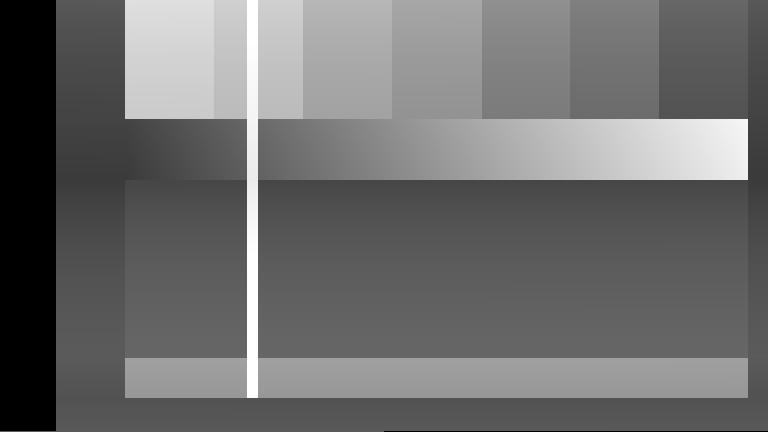

# clamp

> **AI-assisted project.** This codebase was created with [Claude](https://claude.com/claude-code)
> (Anthropic), directed and reviewed by a human author. The amplifier is not
> asserted but measured: an offline harness drives the real plugin class in a
> headless GL context and reads each claim back out of the picture it made —
> after a burst of white, black falls back on exp(−t/τ) with every blanking
> interval counted, at τ of a line, a field and a second; a flat field tilts
> 1 − exp(−T_active/τ) across each line; black shifts with APL by the closed
> form of the steady state; the clamp leaves exp(−T_porch/τ_c) of the error
> behind each porch; every pixel matches a serial double-precision run of the
> same timeline to within 2.3 float ULPs; six host rates give one trajectory;
> the supply's gain follows its attack and recovery — with sixteen negative
> controls that prove each check can fail. It has **never been loaded into Resolume on macOS**; on Windows it passed the
> fleet Arena gate. On macOS it is loaded by [oxbow](https://github.com/stoatworks-labs/oxbow),
> which is a real FFGL host and is not Resolume. See [Status](#status).

A video amplifier whose DC restoration has failed, as an FFGL effect for
[Resolume](https://resolume.com) Arena and Avenue.


<sub>One frame, rendered by `cltest`, the offline harness — not captured from
Resolume. The defaults: 625/50, a coupling of 6.3 ms, a clamp with 0.2% of a time
constant per porch, a little supply sag. Black lightens down the field as the
bright bars at the top bleed out of the capacitor.</sub>

## The one idea

Video amplifiers were joined by capacitors, and **a capacitor does not pass DC**.
The picture's black level is DC. It was put back every line by a *clamp*: a
switch that, in the back porch, pulled the signal to a reference. When the clamp
is weak or dead, the coupling capacitor and the next stage's input resistance
are a high-pass filter on the whole raster, run in time order through every line
and every blanking interval.

The host's frame is placed as the active area of a real 625/50 or 525/59.94
field — sync, back porch, 52 µs of picture, front porch, the blank lines and the
half line, in real time — and that one RC runs through all of it.

## What falls out

None of these is drawn:

- **Black wanders with picture content.** The average over τ is forced to the
  reference, so a bright scene pushes black down and a dark one lifts it.
- **A bright moment darkens the next one**, and the next recovers on the RC's
  curve.
- **Lines tilt** across their width when τ is near a line time, and **fields
  tilt** top to bottom when it is near a field.
- **A healthy clamp takes it all out**, line by line, except the residual its
  own switch leaves over the porch.

Two separate mechanisms sit on top. The **supply sags** with average picture
level and recovers on its own time constants, so the gain breathes with content.
And an optional **triode stage** clips hard on one side, at cutoff, and softly on
the other, where grid current loads the source.



<sub>Show Blanking: the same frame as the whole field — sync (drawn at its tip),
the porch where the clamp closes, the active line, the front porch, and the
vertical blanking below. The whole view is lifted to a quarter grey so blanking can be seen.</sub>

## Controls

| Group | |
| --- | --- |
| **Coupling** | Coupling (τ, 20 µs to 2 s), Standard (625/50, 525/59.94), Per Channel (each of R, G and B its own amplifier, or luma alone) |
| **Clamp** | Clamp Health (dead at 0; 20 time constants a porch — perfect — at 1), Clamp Reference (−0.25 to +0.75: where black is put back, and where the average is forced when it is not) |
| **Supply** | Sag Depth (gain 1 − depth × APL), Sag Attack, Sag Recovery (5 ms to 2 s) |
| **Stage** | Triode On, Bias (toward cutoff or toward grid current), Drive (0.5 to 4) |
| **Output** | Mix, Show Blanking |

Clamp Reference is also where the next stage's grid returns, so it is both the
black level of a working clamp and the average of a dead one. At its default of
+0.25 a failed clamp's picture sits in view; set it to 0 (a quarter of the
slider) for black at black when the clamp is healthy.

## Status

**v0.1.0, and honestly early — 23 September 2026.**

### Measured offline, on macOS

`tools/verify.sh` passes on this machine (M4 Max, macOS 26.4.1) against a fresh
universal Release build, running every rendered check at **two rasters**, 320×180
and 1280×720; the same checks also pass at 333×187 and 1920×1080. Both standards
throughout. What it establishes:

| check | result |
| --- | --- |
| `--droop` | after a burst, the black that follows is on exp(−t/τ) at every measured line or field, worst 0.013 of the derived tolerance; fitted τ 63.998 µs (stated 64), 20.000 ms (20), 0.99999 s (1) for 625/50 |
| `--tilt` | every row of a flat field tilts 0.555906 at τ of a line (stated 0.555906) and 0.0025941 at τ of a field (0.0025941), worst 0.023 of tolerance; at τ = 1 s the derived tolerance (3.4e-5) is two-thirds of the tilt itself (5.2e-5), so there the check bounds the tilt rather than resolving it |
| `--apl` | black moves 0.7481 per unit of APL at τ = 1 s against the steady-state convolution in closed form (worst 0.007 of tolerance) — the fraction of a field that is picture; the state the plugin primes to is the one it settles at, to the bit |
| `--clamp` | the residual after each porch, read from line triples: 0.980199, 0.818731, 0.135335 at 0.02, 0.2 and 2 time constants a porch (stated e^−n to 6 places); a healthy clamp settles black at the reference less what the coupling lets through, to 8e-9 |
| `--reference` | every pixel of ten frames at four settings (dead to strong clamp, luma and per channel, sag, host rates of 50, 60 and 144) against a serial double run of the timeline: worst **2.3 ULP** against a derived bound of 57–83 |
| `--continuity` | host frames at 50, 60, 71.3, 144, 29.97 and 23.976 fps (and 59.94, 60, 50, 23.976 for NTSC) all on one continuous run's trajectory, unseen fields included, worst 1.3e-7 |
| `--sag` | the gain on a patch follows an APL step: fitted attack 0.040 s and recovery 0.200 s (stated 0.04 and 0.2), worst 0.008 of tolerance |
| `--identity` | a perfect clamp, no sag, no triode returns the input within 1.4e-5 (the bound, 2.9e-5, is almost all the line's own drift at τ = 2 s) |
| `--resize` | the raster doubled mid-run; the black level carries straight through it, worst 1.5e-7 |
| `--offline` | timing to BT.470 / SMPTE 170M exactly; the control laws; the blocked walk against a serial per-sample walk to 5.6e-13; a six-day millisecond clock decides the same fields as exact arithmetic on 3,000 frames |
| `--negative` | sixteen perturbed models — blanking dropped, the state reset each host frame (the spec's two), the sample period from the whole line, the switch closed half the porch, the block decay a sample short, attack and recovery swapped, the clamp never closing, a resize that re-primes, a float clock — each **fails** its check, on the physics and not on a clipped reading |
| mutation | one character of the shipped GLSL (`InputW[ j - 1 - i ]` → `j - 0 - i` in the fill) was caught by `--reference` and `--tilt`, then reverted |
| `tools/sweep.py` | all **13** controls measurably change the picture |
| shaders | all 4, as the plugin compiles them, through `glslc` |
| `--pipe` | 2.5 frames in, exactly 2 out; an unknown cue refused (2); a failed render and a closed stdout each exit 1 |
| the bundle | universal (`x86_64 arm64`), exports `plugMain`, ad-hoc signs; `oxbow` reports `SW Clamp` / `CL01` / `effect` and renders 120 frames through `plugMain` |

Render cost at the defaults, best of three runs of 60 frames after a warm-up,
`glFinish` both sides, on a GPU shared with other builds (the figures moved by up
to 2× between runs): **0.36 ms** at 720p, **0.41 ms** at 1080p, **0.82 ms** at 4K.
Every frame reads a small block of sums back to the CPU, which is a pipeline stall
by design. macOS figures only.

### Not established

It has **never been loaded into Resolume on macOS**. Everything above
was compiled, rendered and measured offline against the real plugin class in a
headless CGL context, plus an `oxbow` load. How it looks on footage, how thirteen
controls read in Arena's inspector, and what Arena's clock does to the raster
over a long session are untested. The triode stage and Show Blanking are looks,
checked only for being alive. On Windows, v0.1.0's CI build passed 8 of the fleet Arena gate's 9 checks on win-lab (Resolume Arena 7.27.1, Mesa llvmpipe, no GPU, 2026-09-24), twice: it loads from Extra Effects, registers as `SW Clamp` / `CL01` / effect, all 19 host controls match the declaration, it renders and Arena's log stays clean. The ninth, controls, read Sag Attack and Sag Recovery dead in both runs, because the gate holds a still picture whose level never changes, so the supply sits settled and its time constants have nothing to act on; `--sag` measures both. Software rendering says nothing about a GPU or about speed. No
OpenFX port, not in scope for 0.1.0. There is a [user guide](https://stoatworks-labs.com/software/clamp/guide/). The
[browser demo](https://clamp-demo.stoatworks-labs.com/) runs the plugin's own
shaders and reads the block sums back as the plugin does, but its CPU half — the
timeline, the field walk and the carried capacitor state — is a hand port to
JavaScript, and nothing checks a port but a reader.

## Build

Needs CMake 3.15+, a C++17 compiler, and the FFGL SDK submodule.

```bash
git clone --recursive https://github.com/stoatworks-labs/clamp
cd clamp
cmake -B build -DCMAKE_BUILD_TYPE=Release
cmake --build build --parallel
cmake --install build     # into ~/Documents/Resolume Arena/Extra Effects
```

macOS builds are universal (Apple Silicon + Intel) by default; add
`-DCMAKE_OSX_ARCHITECTURES=arm64` for a faster dev build. Windows needs GLEW via vcpkg.

## Building and testing

The offline harness renders the real plugin class headlessly, on a synthetic
clock at whatever rate a check needs:

```bash
./build/cltest --out /tmp/frame.png --size 1920x1080   # the moving card
./build/cltest --list                                  # every control, kind and default
./build/cltest --droop --tilt --apl --clamp            # each claim, measured
./build/cltest --reference --continuity --sag --identity --resize
./build/cltest --negative                              # and the checks can fail
./build/cltest --offline                               # what needs no GL (CI)
./build/cltest --bench                                 # 720p, 1080p and 4K
python3 tools/sweep.py                                 # no control is silently dead
tools/verify.sh                                        # all of it, on a fresh universal build
```

Every check takes `--size`; run it at 320×180 as well as the raster you care about.
Footage goes through the real shaders with `--pipe`, in the fleet's frame format:

```bash
ffmpeg -i in.mov -f rawvideo -pix_fmt rgba - \
  | ./build/cltest --pipe --size 1920x1080 --fps 50 --script cues.txt \
  | ffmpeg -f rawvideo -pix_fmt rgba -s 1920x1080 -r 50 -i - out.mov
```

See [`CLAUDE.md`](CLAUDE.md) for the full command reference and
[`AGENTS.md`](AGENTS.md) for the model and the traps.

<!-- attributions:start -->
This project is built on other people's work — see [ATTRIBUTIONS.md](ATTRIBUTIONS.md).
<!-- attributions:end -->

## Licence

MIT — see [LICENSE](LICENSE).
